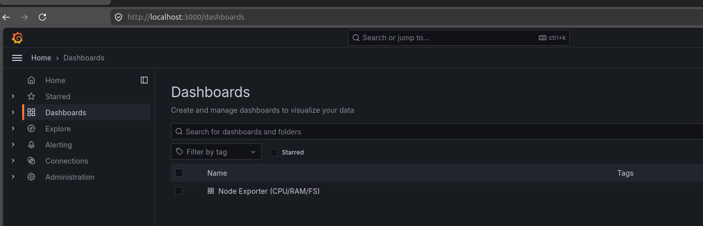
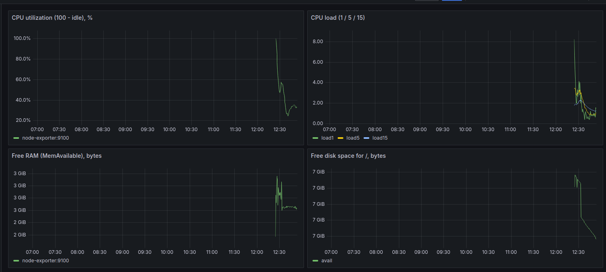
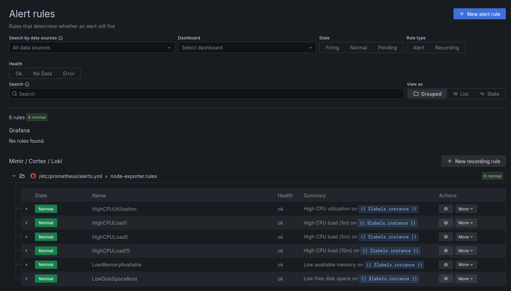

### «Средство визуализации Grafana» - Гривняшкин Р. В.

---
1.

---

2.

- CPU utilization (100 - idle), %: `100 * (1 - avg by(instance) (rate(node_cpu_seconds_total{job="node-exporter",mode="idle"}[5m])))`;
- CPU load (1 / 5 / 15): `node_load1{job="node-exporter"}`, `node_load5{job="node-exporter"}`, `node_load15{job="node-exporter"}`;
- Free RAM (MemAvailable), bytes: `node_memory_MemAvailable_bytes{job="node-exporter"}"`;
- Free disk space for /, bytes: `node_filesystem_avail_bytes{mountpoint="/",job="node-exporter"}`

---

3.

[alerts](./prometheus/alerts.yml)

---

4.

[dashboard file](./grafana/dashboards/node-exporter-dashboard.json)