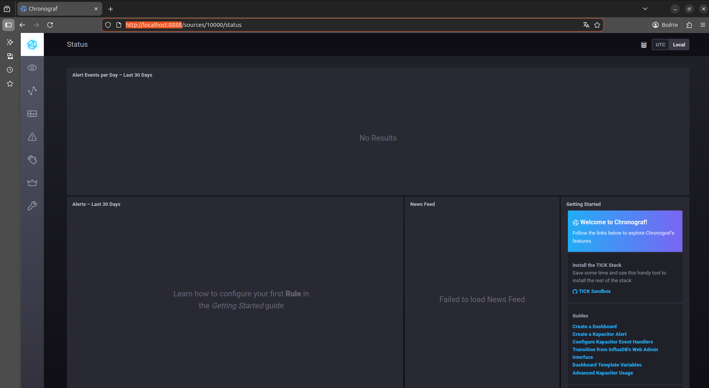
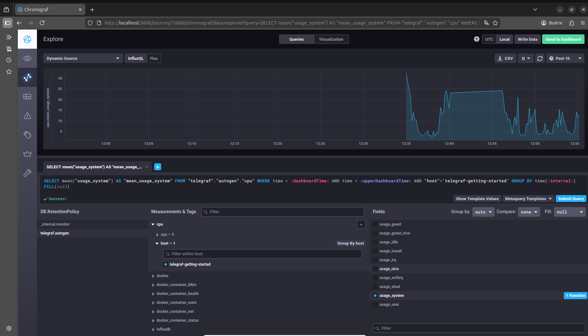

1.

| Категория | Метрика | Почему нужна |
|-----------|---------|--------------|
| Доступность HTTP | `http_requests_total` (по статусам), `http_request_duration_seconds` (p95) | Контроль ошибок и времени ответа API |
| Бизнес-логика | `computations_total` / `computations_failed`, `reports_written_total` | Отслеживание успешности вычислений и записи отчетов |
| Ресурсы CPU | `node_cpu_usage`, `node_load_average` | Высокая нагрузка — ключевая особенность проекта |
| Ресурсы диска | `node_filesystem_free_bytes` | Отчеты сохраняются на диск — контроль свободного места |

Итог: 4 группы метрик покрывают доступность, корректность работы бизнес-процессов и состояние критических ресурсов (CPU, диск).

---
2.

RAM — оперативная память. Метрика показывает ее использование. Если RAM заканчивается, система начинает использовать диск (swap), что резко замедляет вычисления и может привести к OOM-ошибкам (принудительной остановке процессов).

inodes — количество файлов/папок в файловой системе. Даже если место на диске есть, исчерпание inodes сделает невозможным создание новых файлов (отчетов). Критично для платформы, которая сохраняет много мелких текстовых отчетов.

CPUla (Load Average) — среднее количество процессов в очереди на выполнение за 1, 5, 15 минут. Показывает насыщение процессора. Если значение превышает количество ядер — система перегружена, задачи ждут, время ответа растет.

Требуется SLA/SLO-подход:
  - SLA — соглашение с клиентом (например, доступность 99.9%)
  - SLO — целевые значения внутри команды (например, 95% запросов за 2 секунды)

---
3.

| | **Prometheus + Grafana** | **ELK (Elasticsearch, Logstash, Kibana)** |
|---|---|---|
| **Основное назначение** | Мониторинг метрик (числовых данных) | Сбор и анализ логов (текстовых данных) |
| **Тип данных** | Метрики (CPU, RAM, latency, счетчики ошибок) | Логи (строки, stack traces, события) |
| **Хранение** | Time-series database (эффективно для числовых временных рядов) | Полнотекстовый поиск (индексированные строки) |
| **Поиск** | По лейблам и временным диапазонам | Полнотекстовый, фильтрация по полям |

---
4.
Если 2хх ответов 70%, а 5хх и 4хх ответов нет, то разумно предположить, что 30% - это редиректы (3хх).
Стоит заменить формулу на `(summ_2xx_requests+summ_3xx_requests)/summ_all_requests`, если редиректы считаются валидными ответами.

---
5.

## Pull

| Плюсы | Минусы |
|-------|--------|
| Легко обнаруживать недоступные сервисы — если не отвечает, значит, скорее всего, умер | Требуется доступность сети до каждого целевого сервиса (firewall, NAT — проблема) |
| Проще контролировать аутентификацию и авторизацию на стороне сборщика | Сложнее масштабировать при огромном количестве целей (нужен сервис-дискавери) |
| Централизованная конфигурация: что, откуда и как часто собирать | Тяжело собирать метрики с короткоживущих (batch) задач — они могут завершиться до опроса |
| Меньше риска перегрузки целевой системы (сборщик сам регулирует темп) | Нет гарантии, что метрики доставлены при сетевых проблемах |

## Push

| Плюсы | Минусы |
|-------|--------|
| Легко работать с короткоживущими задачами (контейнеры, batch-джобы) — они сами отправляют данные | Сложнее отследить, что сервис перестал отправлять метрики (нет ответа — не значит, что он умер) |
| Не требует открытия сетевых доступов к целевым системам (безопаснее) | Риск перегрузки центрального коллектора при всплесках |
| Подходит для высокодинамических окружений и сервисов за NAT | Нужен механизм ретраев и буферизации на клиенте |
| Легко агрегировать метрики на стороне агента перед отправкой | Конфигурация распределена по агентам, сложнее управлять |

---
6.

| Модель | Системы |
|--------|---------|
| **Pull** | Prometheus, Nagios |
| **Push** | TICK (базово) |
| **Гибридные** | Zabbix, VictoriaMetrics, TICK (условно), Prometheus (+ Pushgateway) |

---
7-8.

